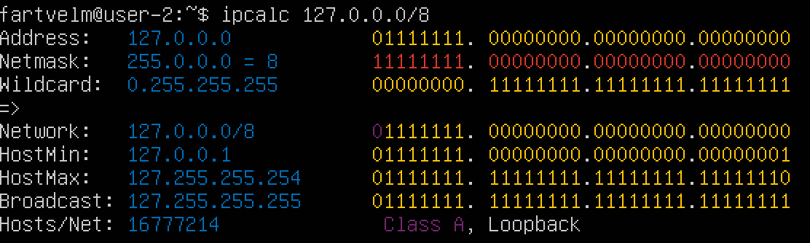
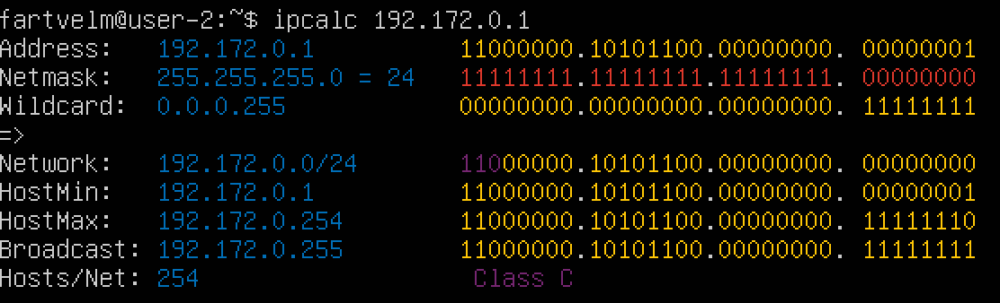
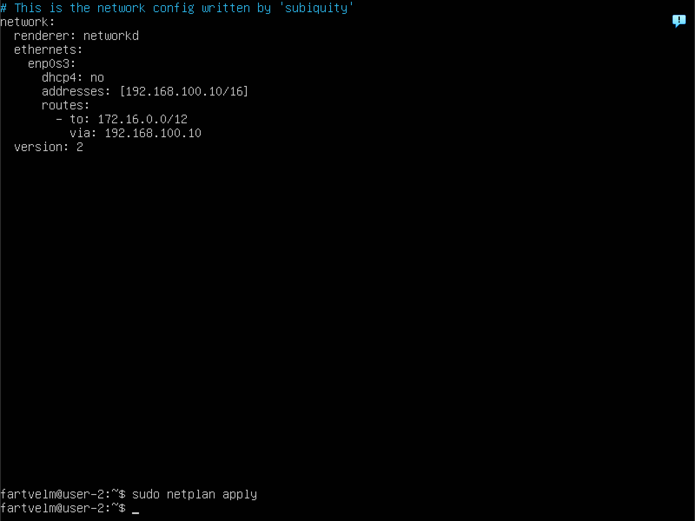
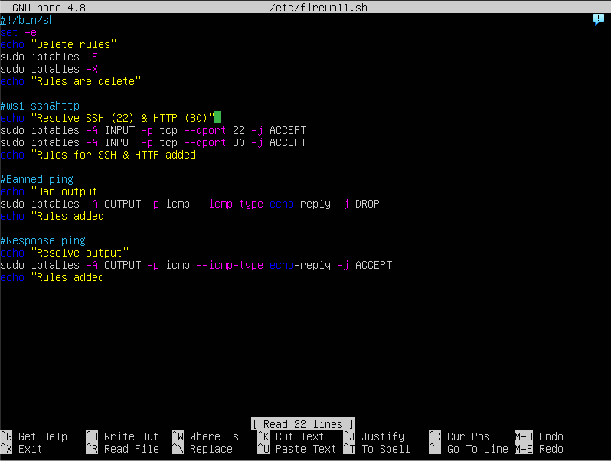
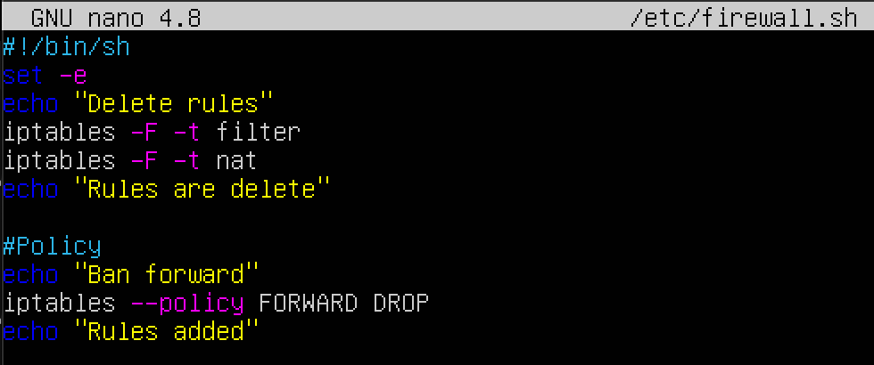
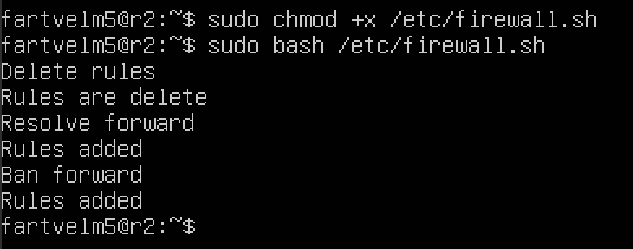

## Part 1. Инструмент ipcalc
- Поднимаем __виртуальную машину__ (_ws1_)  
### 1.1. Сети и маски  
#### Адрес сети
- Определим __адрес сети__ для _IP хоста 192.167.38.54/13_. `/13` в данном случае является _префиксной записью маски подсети_, которая указывает ___количество битов, отведенных под адрес сети___. В данном случае `/13` означает, что первые 13 битов IP-адреса используются _для идентификации сети_, а оставшиеся биты используются _для идентификации хостов внутри этой сети_.  

- Для нахождения адреса сети необходимо:
    1. Преобразовать каждый октет IP-адреса и маски в двоичный код;
        
            IP-адрес: 192.167.38.54
            Двоичный вид: 11000000.10100111.00100110.00110110
            
            Маска /13: 255.248.0.0
            Двоичный вид: 11111111.11111000.00000000.00000000
    2. Произвести побитовую операцию _И_ (&) между двоичным представлением IP-адреса и маски подсети. Это позволит выделить часть адреса, относящуюся к сети;
            
            Побитовая операция &:
            11000000.10100111.00100110.00110110
            &
            11111111.11111000.00000000.00000000
            =
            11000000.10100000.00000000.00000000
    3. Преобразовать полученный двоичный результат обратно в десятичный формат, чтобы получить адрес сети  
            
            Двоичный вид: 11000000.10100000.00000000.00000000
            Десятичный вид: 192.160.0.0
Таким образом, адрес сети для IP-адреса 192.167.38.54 с маской /13 будет 192.160.0.0.

- Проверим выполнив команду `ipcalc 192.167.38.54/13`

 
#### Переводы масок
##### 255.255.255.0
- Переведём маску _255.255.255.0_ __в префиксную форму__, которая указывает ___количество единиц в двоичном представлении маски___. В данном случае, первые три октета (24 бита) состоят из единиц, поэтому префиксная запись будет: `/24`

- Переведём ту же маску __в двоичную запись__, чтобы перевести каждый октет в двоичный формат, мы ___представляем каждое число в виде 8-битного двоичного числа___ (_255 в двоичном: 11111111_). Таким образом, маска _255.255.255.0_ в двоичном формате будет: `11111111.11111111.11111111.00000000`
##### /15
- Переведём маску _/15_ __в двоичную запись__, Это указывает, что ___первые 15 битов маски являются единицами___. Записываем 15 единиц, а оставшиеся 17 битов — нули: `11111111.11111110.00000000.00000000`
- Переведём ту же маску __в привычную форму записи__ (октетами), чтобы перевести каждый октет в двоичный формат, мы ___представляем каждое число в виде 8-битного двоичного числа___ . Таким образом, маска _/15_ в обычной записи будет:
`255.254.0.0`
##### 11111111.11111111.11111111.11110000
- Переведём маску _11111111.11111111.11111111.11110000_ __в префиксную форму__, которая указывает ___количество единиц в двоичном представлении маски___. В данном случае, первые 28бит состоят из единиц, поэтому префиксная запись будет: `/28`
- Переведём ту же маску __в привычную форму записи__ (октетами), чтобы перевести каждый октет в двоичный формат, мы ___представляем каждое число в виде 8-битного двоичного числа___ . Таким образом, маска _11111111.11111111.11111111.11110000_ в обычной записи будет:
`255.255.255.240`
#### Минимальный и максимальный хост
__HostMin__ - минимальный адрес, который может быть назначен хосту в сети. Обычно это _первый адрес после адреса сети_.   
__HostMax__ - максимальный адрес, который может быть назначен хосту в сети. Обычно это _последний адрес перед широковещательным адресом_. 
- В сети `12.167.38.4`(_00001100.10100111.00100110.00000100_), с маской подсети `/8`(_255.0.0.0_), cеть определяется путем применения маски к IP-адресу. В данном случае адресом сети будет `12.0.0.0`
        
        HostMin - 12.0.0.1
        HostMax - 12.255.255.254
- В сети `12.167.38.4`(_00001100.10100111.00100110.00000100_), с маской подсети `11111111.11111111.00000000.00000000`(_255.255.0.0_), cеть определяется путем применения маски к IP-адресу. В данном случае адресом сети будет `12.167.0.0`
        
        HostMin - 12.167.0.1
        HostMax - 12.167.255.254
- В сети `12.167.38.4`(_00001100.10100111.00100110.00000100_), с маской подсети `255.255.254.0`(_11111111.11111111.11111110.00000000_), cеть определяется путем применения маски к IP-адресу. В данном случае адресом сети будет `12.167.38.0`
        
        HostMin - 12.167.38.1
        HostMax - 12.167.39.254
        Обращаем внимание, что максимальный адрес хоста включает адреса из следующего октета, поскольку маска /23 охватывает два октета (38 и 39).
- В сети `12.167.38.4`(_00001100.10100111.00100110.00000100_), с маской подсети `/4`(_11110000.00000000.00000000.00000000_), cеть определяется путем применения маски к IP-адресу. В данном случае адресом сети будет `0.0.0.0`
        
        HostMin - 0.0.0.1
        HostMax - 15.255.255.254
        Это объясняется тем, что маска /4 позволяет использовать адреса от 0.0.0.0 до 15.255.255.255.
### 1.1. localhost 
__localhost__ — это специальный адрес, который _ссылается на текущий компьютер_. В IPv4 это соответствует адресу 127.0.0.1. Все адреса в диапазоне 127.0.0.0 до 127.255.255.255 также ссылаются на localhost и называются "loopback" адресами. Это означает, что __любой трафик, отправленный на эти адреса, не покидает машину__, а обрабатывается локально.
- Рассмотрим указанные IP-адреса и __определим__, можно ли к приложению на localhost обратиться с каждого из них
<table>
    <tr>
        <th>IP-адрес</th>
        <th>Можно обратиться?</th>
        <th>Причина</th>
    </tr>
    <tr>
        <td>194.34.23.100</td>
        <td>Нет</td>
        <td>Внешний адрес, не попадает в loopback.</td>
    </tr>
    <tr>
        <td>127.0.0.2</td>
        <td>Да</td>
        <td>Внутренний адрес, попадает в loopback.</td>
    </tr>
    <tr>
        <td>127.1.0.1</td>
        <td>Да</td>
        <td>Внутренний адрес, попадает в loopback.</td>
    </tr>
    <tr>
        <td>128.0.0.1</td>
        <td>Нет</td>
        <td>Внешний адрес, не попадает в loopback.</td>
    </tr>
</table>

### 1.3. Диапазоны и сегменты сетей
__Частные IP-адреса__  
Согласно стандартам, следующие диапазоны IP-адресов считаются частными:

        10.0.0.0 — 10.255.255.255 (10.0.0.0/8)
        172.16.0.0 — 172.31.255.255 (172.16.0.0/12)
        192.168.0.0 — 192.168.255.255 (192.168.0.0/16)
Все адреса вне этих диапазонов являются __публичными__.  

- Теперь давайте проанализируем указанные IP-адреса и определим, какие из них могут быть шлюзами для сети `10.10.0.0/18`

<table>
    <tr>
        <th>IP-адрес</th>
        <th>Возможен как шлюз</th>
        <th>Причина</th>
    </tr>
    <tr>
        <td>10.0.0.1</td>
        <td>Нет</td>
        <td>Вне диапазона 10.10.0.0/18.</td>
    </tr>
    <tr>
        <td>10.10.0.2</td>
        <td>Да</td>
        <td>В пределах диапазона 10.10.0.0/18.</td>
    </tr>
    <tr>
        <td>10.10.10.10</td>
        <td>Да</td>
        <td>В пределах диапазона 10.10.0.0/18.</td>
    </tr>
    <tr>
        <td>10.10.100.1</td>
        <td>Нет</td>
        <td>Вне диапазона 10.10.0.0/18.</td>
    </tr>
    <tr>
        <td>10.10.1.255</td>
        <td>Да</td>
        <td>В пределах диапазона 10.10.0.0/18.</td>
    </tr>
</table>

---

## Part 2. Статическая маршрутизация между двумя машинами
- Поднимем вторую виртуальную машину, и с помощью команды `ip a` посмотрим существующие сетевые интерфейсы

  

Сетевой интерфейс `enp0s3` — это название сетевого интерфейса, используемого в большинстве современных дистрибутивов Linux, основанное на схеме именования __Predictable Network Interface Names__. Этот интерфейс, как правило, _используется для подключения к внутренним сетям_ в виртуальных машинах или физических серверах.
- Для установки соединения _между машинами_ в разных сетях необходима настройка сети ВМ - ___Сетевой мост___ 
- __Зададим статические адреса и маски__ для обеих машин. Для этого требуется _открыть и отредактировать конфигурационный файл_ c помощью команды `sudo nano /etc/netplan/00-installer-config.yaml`. Для первой машины добавить адрес — _192.168.100.10/16_, для второй — _172.24.116.8/12_. Чтоб применить изменения необходимо использовать `sudo netplan apply`  

   

- Добавим статический маршрут от одной машины до другой и обратно при помощи команды вида `ip r add` ( __ip route add__ _<сеть>/<маска>_ __via__ _<IP_шлюза>_ __dev__ _<интерфейс>_ )
                 
          В нашем случае:
          
          sudo ip route add 172.16.0.0/12 via 192.168.100.10 dev enp0s3 - ws1
          sudo ip route add 192.168.0.0/16 via 172.24.116.8 dev enp0s3 - ws2

 
- Пропингуем машины между друг другом,

  

- __Зададим статический маршрут со сохранением__ для обеих машин. Для этого требуется _открыть и отредактировать конфигурационный файл_ `netplan`

        
        routes: (маршрут)
          - to: 172.16.0.0/12 (это сеть назначения)
            via: 192.168.100.1 (это IP-адрес шлюза (gateway))

            Параметр gateway обычно применяется для описания дефолтного шлюза интерфейса, а не для произвольных маршрутов.

___to___ — это сеть назначения (_куда вы хотите отправлять пакеты_).  
___via___ — это IP-адрес шлюза (gateway), _через который нужно отправлять пакеты в сеть назначения_.

__Иными словами:__  
Когда наш компьютер хочет отправить данные в сеть 172.16.0.0/12, он сначала отправит их на шлюз 192.168.100.1.
_Шлюз уже знает_, как доставить эти данные дальше.  
__Важное замечание про шлюз и маршруты__:  
Если сеть назначения находится в той же подсети, что и ваш IP, шлюз не нужен — _пакет отправляется напрямую_.
Если сеть назначения вне вашей подсети, нужен шлюз, чтобы «переправить» пакет.

- Пропингуем машины между друг другом,

---
## Part 3. Утилита iperf3  
__Скорость соединения__ — это мера того, _насколько быстро данные могут передаваться по сети_. Она измеряется в битах в секунду (_bps_), килобитах в секунду (_Kbps_), мегабитах в секунду (_Mbps_) и гигабитах в секунду (_Gbps_).  
<table border="1" cellpadding="5" cellspacing="0">
  <thead>
    <tr>
      <th>Исходное значение</th>
      <th>Формула перевода</th>
      <th>Результат</th>
    </tr>
  </thead>
  <tbody>
    <tr>
      <td>8 Mbps → MB/s</td>
      <td>8 Mbps ÷ 8(бит)</td>
      <td>1 MB/s</td>
    </tr>
    <tr>
      <td>100 MB/s → Kbps</td>
      <td>100 × 8 × 1000</td>
      <td>800 000 Kbps</td>
    </tr>
    <tr>
      <td>1 Gbps → Mbps</td>
      <td>1 × 1000</td>
      <td>1000 Mbps</td>
    </tr>
  </tbody>
</table>  
     
         В некоторых контекстах, особенно в вычислительной технике, используется двоичная система, где 1 Мегабайт = 1024 * 1024 байт. Но в случае сетевых скоростей, как правило, применяется десятичная система.  

- Установим утилиту `iperf3` на обе машины, выполнив команду `sudo apt install iperf3`

`iperf` (_часто используют современную версию — iperf3_) — это инструмент для измерения пропускной способности (скорости передачи данных) в сети между двумя хостами.

- Запустим iperf3 в режиме сервера на одной машине (ws2) командой `iperf3 -s`. Для теста скорости iperf работает в клиент-серверном режиме:
1. Одна машина запускает iperf в режиме сервера `iperf3 -s`.
2. Другая — в режиме клиента `iperf3 -c <IP-сервера>`.  

Если обе ВМ запущены на одном физическом хосте (например, на вашем компьютере), __они всё равно имеют разные IP-адреса в виртуальной сети__. Для того чтобы клиент знал, куда подключаться, нужно узнать и указать IP сервера. _Без этого клиент не сможет найти сервер_

  

---
## Part 4. Сетевой экран
### iptables
__Сетевой экран__ (_firewall_) — это программное или аппаратное средство, которое ___контролирует проходящий через него сетевой трафик___ по заданным правилам. В Linux для создания таких правил часто используют утилиту `iptables`.

__Порядок правил очень важен__.
В `iptables` правила обрабатываются последовательно _сверху вниз_.
Первое совпавшее правило решает судьбу пакета — разрешить (_ACCEPT_), запретить (_DROP_), или передать дальше.
Если ни одно правило не сработало, применяется политика цепочки (_policy_), обычно ACCEPT или DROP.

- Необходимо __создать скрипт__, чтобы не настривать правило самостоятельно _каждый раз_.
        
        1. Открыть доступ к портам 22 (SSH) и 80 (HTTP) — чтобы вы могли подключаться по ssh и web-серверам.

        2. Запретить echo reply — чтоб машина не отвечала на ping (для создания эффекта «невидимости»).

        3. Разрешить echo reply — чтоб машина нормально отвечала на ping.

        4. В скрипте меняется порядок этих правил, и в зависимости от стратегии меняется итоговое поведение.

    
 

         iptables -F:
           Флаг -F: Flush (очистка) всех правил в выбранных цепочках. Если ранее были правила для блокировки портов, они удаляются.  

         iptables -X:
           Флаг -X: Удаление пользовательских цепочек. Удаляет все созданные вручную цепочки (например, MY_CHAIN).

         iptables -A INPUT -p tcp --dport 22 -j ACCEPT:
           -A INPUT: Добавляет правило в конец цепочки INPUT (входящий трафик).
           -p tcp: Указывает протокол TCP.
           --dport 22: Destination port (порт назначения) — 22 (SSH).
           -j ACCEPT: Принимает пакет.
         Итог: Разрешает входящие SSH-подключения.

         iptables -A INPUT -p tcp --dport 80 -j ACCEPT:
           Аналогично предыдущему, но для порта 80 (HTTP).
        Итог: Разрешает входящие HTTP-запросы.

        iptables -A OUTPUT -p icmp --icmp-type echo-reply -j DROP:
          -A OUTPUT: Добавляет правило в цепочку OUTPUT (исходящий трафик).
          -p icmp: Указывает протокол ICMP (используется для ping)--icmp-type echo-reply: Тип ICMP-пакета — ответ на ping (echo-reply).
          -j DROP: Отбрасывает пакет.
        Что делает: Запрещает отправку ответов на ping-запросы.Проблема: Это правило конфликтует со следующим.

        iptables -A OUTPUT -p icmp --icmp-type echo-reply -j ACCEPT:
          -j ACCEPT: Принимает пакет.
        Что делает: Разрешает отправку ответов на ping.
        Ошибка: Правила обрабатываются сверху вниз. Поскольку правило DROP добавлено первым, оно сработает раньше, и ACCEPT никогда не выполнится.
        Итог: Ответы на ping будут запрещены, несмотря на второе правило.

 

- Запустим скрипты, но для начала выдадим права с помощью команды `sudo chmod +x /etc/firewall.sh`, затем запустим с помощью команды `sudo /etc/firewall.sh`. Проверим командой `iptables -L` весь список правил.

### nmap

__nmap__ (***N**etwork **Map**per*) — это мощная утилита для сканирования сети, которая может использоваться **для обнаружения активных хостов**, открытых портов и сервисов, работающих на этих портах. nmap *отправляет различные пакеты на целевой хост* и анализирует ответы, чтобы определить, какие порты открыты, какие службы работают и доступен ли хост.

- Проверим пингуется ли ws2 с ws1 (_после запрета в firewall_), командой `ping 192.168.100.10`

- Проверим __доступность хоста__ с помощью команды `nmap -sn 192.168.100.10`, где флаг `-sn` указывает Nmap выполнять только проверку хоста (_без сканирования портов_).

В контексте виртуальных машин под ___«дампами»___ обычно понимают снимки состояния (_snapshots_) или дампы памяти, которые __позволяют сохранить текущее состояние ВМ__ для последующего восстановления. Сохраним в настройках VirtualBox-...-snapshots-take   

---

## Part 5. Статическая маршрутизация сети
___Роутеры и виртуальные машины___ — это разные концепции в области сетевых технологий и виртуализации. Рассмотрим отличия между роутерами и виртуальными машинами.

__Определение:__

- Роутер: Устройство, предназначенное для передачи данных между различными сетями. Он анализирует адреса пакетов и принимает решения о том, как их направить.

- Виртуальная машина: Эмуляция физического компьютера, работающая на гипервизоре. Виртуальная машина может запускать операционные системы и приложения так же, как и физический компьютер.

__Функции:__

- Роутер: Основная функция — маршрутизация трафика между сетями, управление сетевыми протоколами и обеспечение безопасности (например, с помощью встроенных брандмауэров).

- Виртуальная машина: Может выполнять любые задачи, которые может выполнять физический компьютер, включая запуск серверов, приложений и служб.

__Использование:__

- Роутеры: Используются в сетевой инфраструктуре для соединения различных сетей (например, локальной и интернет).

- Виртуальные машины: Используются для тестирования, разработки, запуска серверов и приложений в изолированной среде.

### Настройка адресов машин

- Поднимем 5 виртуальных машин, 3 из них будут хостами, 2 - роутерами. Для соединения их в одну сеть необходимо настроить `netplan` согласно рисунку: 

- Перезапустим сервис сети с помощью команды `sudo systemctl restart systemd-networkd`. А командой `ip -4 a` проверим, что адрес машины задан верно.

- Чтобы убедиться, что обе машины (_WS11 и R1_) __находятся в одной сети__ или имеют правильные маршруты, чтобы _взаимодействовать друг с другом_, используем `ping <ip-адрес>`

- На _r1_ и _r2_ __не включена__ переадресация пакетов, роутеры _не будут пересылать пакеты между сетями_, используем команду `sudo sysctl -w net.ipv4.ip_forward=1`
     
        sysctl: Это утилита для просмотра и изменения параметров ядра Linux во время работы системы. Она позволяет управлять различными настройками, связанными с производительностью и безопасностью системы.
        
        -w: Этот флаг указывает sysctl, что вы хотите записать (изменить) значение параметра.
        
        net.ipv4.ip_forward: Это конкретный параметр, который отвечает за включение или отключение IP-маршрутизации. Если этот параметр установлен в 1, это означает, что маршрутизация включена; если 0, то выключена.

- Изменение, сделанное с помощью `sysctl -w`, __не сохраняется__ после перезагрузки. Чтобы сделать это изменение постоянным, добавьте строку `net.ipv4.ip_forward = 1` в файл `/etc/sysctl.conf` или создайте новый файл в каталоге `/etc/sysctl.d/`. 

- Проверим __таблицу маршрутизации__ с помощью команды `ip r`

- Пропингуем с `ws11` роутер `r2` и покажем на `r2`, что пинг доходит, используя команду `tcpdump -tn -i eth0`, где `-t` - параметр отключающий вывод временных меток, `-n` - параметр отключающий разрешение имен. `i eth0` - параметр указывает, на каком интерфейсе будет производиться захват трафика. Данные ключи ускоряют процесс за ненадобностью сторонней информации. 

- Добавим в роутеры `r1` и `r2` __статические маршруты__ в файле конфигураций

- Вызовем `ip r`, чтоб увидеть _таблицы с маршрутами_ на обоих роутерах

Проверка маршрутов ws11 для сети 10.10.0.0 с заданной маской:

`ip r list 10.10.0.0/[маска сети]`

`ip r list 0.0.0.0/0`

- Объясним, почему для адреса 10.10.0.0/[маска сети] __был выбран маршрут, отличный__ от 0.0.0.0/0, _хотя он попадает под маршрут по-умолчанию_.
    
        Для адреса 10.10.0.0/18 выбирается более специфичный маршрут, а не маршрут по умолчанию, так как в таблице маршрутизации более длинная маска сети имеет приоритет над менее специфичными маршрутами.

---

__Traceroute__ — это сетевой инструмент, который используется для определения пути, по которому пакеты данных проходят от одного компьютера (или устройства) до другого в сети. Он _помогает выявить промежуточные узлы_ (маршрутизаторы) на этом пути и измерить время, необходимое для передачи пакетов до каждого из этих узлов.

- Команда для запуска __захвата пакетов__ на интерфейсе _enp0s3_ маршрутизатора r1: `sudo tcpdump -tnv -i enp0s3`

- При помощи утилиты __traceroute__ построим _список маршрутизаторов_ на пути от ws11 до ws21

__Объяснение принципа работы traceroute:__ 
     
      Утилита отправляет пакеты с постепенно увеличивающимся значением TTL (Time To Live). Каждый маршрутизатор уменьшает TTL на 1, и когда TTL достигает 0, роутер отправляет обратно ICMP-сообщение "Time Exceeded", что позволяет определить IP-адрес каждого промежуточного маршрутизатора на пути.

- Запустим на `r1` __перехват сетевого трафика__, проходящего через enp0s3 с помощью команды: `tcpdump -n -i enp0s3 icmp`

- Пропингуем с ws11 _несуществующий IP_ (например, 10.30.0.111) с помощью команды: `ping -c 1 10.30.0.111`

---

## Part 6. Динамическая настройка IP с помощью DHCP

__DHCP__ (_Dynamic Host Configuration Protocol_) — протокол для автоматического назначения IP-адресов и других сетевых параметров (шлюз, DNS, маска) клиентам в сети.
     
     Discover — клиент ищет DHCP-сервер.
     
     Offer — сервер предлагает IP-адрес.
     
     Request — клиент запрашивает предложенный адрес.
     
     Ack — сервер подтверждает выделение адреса.

Если утилита `isc-dhcp-server` ещё не установлена, то файла `/etc/dhcp/dhcpd.conf` ещё _не существует в нужном виде_. Соотвтетственно для работы с протоколом DHCP сначала надо установить эту утилиту
- Для `r2` настроим в файле `/etc/dhcp/dhcpd.conf` конфигурацию службы DHCP. Файл `/etc/dhcp/dhcpd.conf` используется для настройки DHCP-сервера, который __раздает IP-адреса__ и другие сетевые параметры клиентам в сети. 

      subnet 10.100.0.0 netmask 255.255.0.0 {}  
        Транзитная сеть (пустая конфигурация)
        
      subnet 10.20.0.0 netmask 255.255.255.192 {  
        Сеть для клиентов (ws21, ws22)
      
      range 10.20.0.2 10.20.0.50;             
        Диапазон выдаваемых адресов
        
      option routers 10.20.0.1;              
        Шлюз по умолчанию (r2)
        
      option domain-name-servers 8.8.8.8;     
        DNS-сервер (Google Public DNS)}
__Пояснение:__

subnet 10.20.0.0 netmask 255.255.255.192 — _сеть с маской /26 (62 доступных адреса)_.

range — _диапазон адресов для автоматической выдачи_.

option routers — _IP роутера, через который клиенты выходят в другие сети._

option domain-name-servers — _DNS-сервер для разрешения доменных имён._

- В файле _resolv.conf_ пропишем _nameserver 8.8.8.8._
Файл `/etc/resolv.conf` содержит _информацию о DNS-серверах_, которые используются __для разрешения доменных имен в IP-адреса__.

- __Перезагрузим__ службу DHCP командой `sudo systemctl restart isc-dhcp-server`. Проверим статус службы `sudo systemctl status isc-dhcp-server`.

- Машину _ws21_ перезагрузим при помощи `reboot` и через `ip a` покажи, что она получила адрес. Пропингуй ws22 с ws21.

MAC-адрес (_Media Access Control address_) — это уникальный идентификатор, присваиваемый сетевому интерфейсу __для использования в сетевых коммуникациях на уровне канала__ (Layer 2) модели OSI. ___MAC-адрес используется для идентификации устройств в локальной сети___ и обычно записывается в шестнадцатеричном формате, состоящем из 6 байтов (например, 00:1A:2B:3C:4D:5E).

- Укажи MAC-адрес у ws11, для этого в `etc/netplan/00-installer-config.yaml` надо добавить строки: `macaddress: 10:10:10:10:10:BA`, `dhcp4: true`.

- Для `r1` настроем аналогично `r2`, но сделаем выдачу адресов с __жесткой привязкой к MAC-адресу__ (ws11). настроим в файле `/etc/dhcp/dhcpd.conf` _конфигурацию службы DHCP_, добавив статическое назначение IP для MAC-адреса.
    
        Пример записи:
        host ws11 {
            hardware ethernet 10:10:10:10:10:ba;
            fixed-address 192.168.1.100;
            }
            
            ws11 — имя хоста (можно любое).
            
            hardware ethernet — MAC-адрес устройства (в нижнем регистре, как правило).
            
            fixed-address — IP-адрес, который всегда будет выдаваться этому устройству.

- В файле _resolv.conf_ пропишем _nameserver 8.8.8.8_. Файл `/etc/resolv.conf` содержит информацию о DNS-серверах, которые используются для разрешения доменных имен в IP-адреса.

- __Перезагрузим__ службу DHCP командой `sudo systemctl restart isc-dhcp-server`. Проверим статус службы `sudo systemctl status isc-dhcp-server`.

- Машину _ws11_ перезагрузим при помощи `reboot` и через `ip a` покажи, что она получила адрес. Пропингуй ws21 с ws11.

- Запросим с _ws21_ __обновление IP-адреса__. Команда `sudo dhclient -r eth0`(_release_) сообщает DHCP-серверу, что клиент освобождает текущий адрес. Интерфейс теряет IP-адрес.

- Запросим новый IP-адреса (_renew_). Команда `sudo dhclient eth0` отправляет запрос на получение нового IP-адреса. DHCP-сервер выделяет адрес из пула, учитывая настройки (например, диапазон, привязку по MAC).

---
  
## Part 7. NAT

__Apache HTTP Server__, часто называемый просто _Apache_, — это один из самых популярных веб-серверов в мире. Он используется для обслуживания веб-страниц и может обрабатывать запросы на HTTP и HTTPS. Apache является свободным программным обеспечением, что делает его доступным для использования и модификации.

Для работы с сервером apache2, установим его на машины _r1, r2 и ws22_, с помощью команды `sudo apt install apache2`

- Сделаем сервер Apache2 __общедоступным__, для этого в файле `/etc/apache2/ports.conf` на _ws22_ и _r1_ измени строку `Listen 80` на `Listen 0.0.0.0:80`.
    

         0.0.0.0:80 — это адрес, который позволяет серверу принимать запросы на всех доступных сетевых интерфейсах.

- __Запустим веб-сервер Apache__ командой `service apache2 start` на _ws22 и r1_. Проверим работу сервиса командой `systemctl status apache2`

- Добавим в фаервол, созданный по аналогии с фаерволом из Части 4, на _r2_ следующие правила:

      1) Удаление правил в таблице filter — iptables -F;
      
      2) Удаление правил в таблице «NAT» — iptables -F -t nat;
      
      3) Отбрасывать все маршрутизируемые пакеты — iptables --policy FORWARD DROP.

- Проверим соединение между _ws22 и r1_ командой _ping_. При запуске файла с этими правилами, ws22 __не должна «пинговаться»__ с r1.

- Добавим в файл ещё одно правило. Разрешить маршрутизацию всех пакетов протокола ICMP.

          -A FORWARD — добавить (-A от append) правило в цепочку FORWARD. Цепочка FORWARD отвечает за обработку пакетов, которые пересылаются через ваш компьютер (например, если он работает как маршрутизатор)
          
          -p icmp — правило применяется к пакетам протокола ICMP (Internet Control Message Protocol), который используется для служебных сообщений в сети, например, для команды ping
          
          -j ACCEPT — действие (jump) для совпадающих пакетов — принять (разрешить) их прохождение.

- Проверим соединение между _ws22 и r1_ командой _ping_. При запуске файла с этими правилами, ws22 должна «пинговаться» с r1.

### SNAT

__SNAT__ (_Source Network Address Translation_) — это технология ___преобразования исходного IP-адреса___ пакета при его выходе из локальной сети в другой IP-адрес, _обычно внешний адрес маршрутизатора_.

- Наша машина выступает в роли маршрутизатора между внешним интерфейсом и внутренней сетью (где находится веб-сервер). Чтобы пакеты с запросами к веб-серверу проходили через неё, нужно явно разрешить форвардинг TCP-трафика на порт 80. Выполним команду `iptables -A FORWARD -p tcp --dport 80 -j ACCEPT`
     
          -p tcp — правило применяется только к пакетам протокола TCP
          
          --dport 80 — фильтровать пакеты, у которых порт назначения равен 80 (обычно HTTP).

- Включим SNAT, __замаскируем__ все локальные IP из сети 10.20.0.0/26 (где находится ws22) _под внешний IP роутера_ r2. Это нужно, чтобы пакеты из локальной сети выглядели как исходящие с адреса роутера r2, иначе маршрутизаторы внешней сети не смогут корректно направлять ответные пакеты. Добавим правило в сетевой экран - `iptables -t nat -A POSTROUTING -o enp0s3 -s 10.20.0.0/26 -j SNAT --to-source 10.100.0.12`

       -t nat — работаем с таблицей NAT.
       
       -A POSTROUTING — добавляем правило в цепочку POSTROUTING (после маршрутизации).
       
       -s 10.20.0.0/26 — исходящая подсеть локальной сети.
       
       -o enp0s3 — интерфейс выхода во внешнюю сеть.
       
       -j SNAT --to-source 10.100.0.12 — подменяем исходящий IP на внешний IP r2.
       
Роутер r2 с IP 10.100.0.12 в сети 10.100.0.0/16 выступает как __шлюз__ для локальной сети 10.20.0.0/26. Если IP 10.100.0.12 _статический и не меняется_, то SNAT с --to-source подходит, если динамический — лучше использовать ___MASQUERADE___.

- ___Совет:___ стоит подумать ___о маршрутизации внутренних пакетов___, а также внешних пакетов с установленным соединением. Для того чтобы пакеты из внутренней сети (10.20.0.0/26) _могли проходить через r2_ в внешнюю сеть (10.100.0.0/16) и обратно, необходимо _разрешить пересылку IP-пакетов между интерфейсами_ (форвардинг).

- Включение форвардинга — __базовое требование для маршрутизатора__. Выполним команду `sudo sysctl -w net.ipv4.ip_forward=1`, однако изменения будут работать _до перезагрузки_. Для _постоянного включения_ в файле `/etc/sysctl.conf` нужно добавить или раскомментировать строку `net.ipv4.ip_forward=1`.

В Linux, когда вы _настраиваете маршрутизатор_ с помощью `iptables`, по умолчанию политика в цепочке FORWARD часто стоит как DROP (_блокировать все проходящие пакеты_). Это означает, что пакеты, которые приходят на один интерфейс и должны быть пересланы на другой (форвардятся), __просто отбрасываются__.

Поэтому для корректной работы маршрутизации и NAT ___нужно явно разрешить форвардинг пакетов___, особенно для тех соединений, которые уже установлены или только устанавливаются. 

- Разрешим форвардинг для пакетов с установленным соединением. Это делается с помощью модуля состояния соединения командой `iptables -A FORWARD -m state --state ESTABLISHED -j ACCEPT`
    
        Модуль state позволяет фильтровать пакеты по состоянию их сетевого соединения (например, новое, установленное, связанное).
        
        ESTABLISHED:
        Это состояние означает, что пакет принадлежит уже установленному соединению. Например, если ваш внутренний сервер отправил запрос на внешний сервер, а ответ от этого сервера — это уже ESTABLISHED соединение.
        Пакеты, относящиеся к этому состоянию, должны быть разрешены, чтобы обеспечить корректную работу приложений (например, HTTP, FTP и т.д.).

### DNAT

__DNAT__ (_Destination Network Address Translation_) — это технология __изменения адреса назначения__ (destination) пакета. Используется, когда нужно _перенаправить входящие пакеты с одного адреса/порта на другой адрес/порт_.

- __Включим__ DNAT на `8080` порт машины `r2` и ___добавить к веб-серверу Apache___, запущенному на `ws22`, доступ извне сети. Это означает, что когда внешний клиент (например, r1) _пытается подключиться_ к r2 на порт 8080, __происходит новое TCP-соединение__, которое должно быть _перенаправлено_ (DNAT) на внутренний сервер ws22. Добавим правило `iptables -t nat -A PREROUTING -i enp0s3 -p tcp --dport 8080 -j DNAT --to-destination 10.20.0.20:80`.

      -t nat - Использовать таблицу nat (Network Address Translation) — отвечает за преобразование адресов и портов пакетов
      
      -A PREROUTING	- Добавить (-A = append) правило в цепочку PREROUTING. Эта цепочка обрабатывает пакеты до маршрутизации
      
      -i enp0s3	 - Применять правило только к пакетам, пришедшим на интерфейс enp0s3 (обычно внешний сетевой интерфейс)
      
      -p tcp	Фильтровать только TCP-пакеты
      
      --dport 8080	Применять правило только к пакетам, направленным на порт назначения 8080
      
      -j DNAT	Цель (jump) — выполнить DNAT (Destination NAT), то есть изменить адрес назначения пакета
      
      --to-destination 10.20.0.20:80	Новый адрес и порт назначения: IP 10.20.0.20, порт 80. Пакеты будут перенаправлены на этот адрес и порт.

- ___Совет:___ стоит учесть, что при попытке подключения возникнет _новое tcp-соединение_, которое должно быть перенаправлено (DNAT) на внутренний сервер ws22, порт 80. Для корректной обработки такого соединения нужно:

  1. Правильно настроить правило DNAT в цепочке __PREROUTING__, чтобы перенаправить пакеты на `ws22:80`.

  2. В цепочке __FORWARD__ разрешить новые TCP-соединения к `ws22` на порт `80`.

  3. Разрешить уже __установленные и связанные соединения__ (_ответы_) для корректного обмена пакетами.

- Если клиент отправляет SYN-пакет на `r2:8080`, `r2` (_благодаря DNAT_) __меняет адрес назначения__: с `10.100.0.12:8080` → `10.20.0.20:80`, однако исходный адрес __остаётся клиентским__ (_например, `10.100.0.11`_). Этот модифицированный пакет направляется к `ws22`, которая видит новое входящее соединение от `10.100.0.11` на свой порт `80`. Это и есть _"новое TCP-соединение"_, о котором говорит совет.

- Проблема __без правильной настройки__ в том, что `ws22` получит SYN-пакет и ответит SYN-ACK __напрямую клиенту__ (_`10.100.0.11`_), но клиент ожидает ответ от `r2` (_`10.100.0.12`_), а не от `ws22` (_`10.20.0.20`_). Как итог: клиент игнорирует непонятный SYN-ACK → ___соединение не устанавливается___

### Проверка доступов
#### SNAT

Убедимся, что трафик из локальной сети `10.20.0.0/26` __маскируется__ под IP `r2` (_`10.100.0.12`_). 
- Для этого подготовим на `r1` __веб-сервер Apache__, запустим командой `sudo systemctl start apache2` 
- __Разрешим входящие подключения__ на порт `80` с помощью `ufw` (_Uncomplicated Firewall_) — простой интерфейс для настройки брандмауэра (_firewall_) на базе `iptables`. Для этого используем команду `sudo ufw allow 80/tcp`

- Чтобы проверить, __открыт ли порт 80__ из внешней сети, можно использовать команду `telnet 10.100.0.11 80` на `ws22`, которая запустит _подключение к удалённому хосту_. Если соединение __установлено — порт открыт__ и доступен. Если соединение __не устанавливается — порт закрыт__ или блокируется брандмауэром.

#### DNAT

Убедимся, что трафик, направленный на `r2:8080`, __перенаправляется__ на `ws22:80`. 
- Для этого подготовим на `ws22` __веб-сервер Apache__, запустим командой `sudo systemctl start apache2` 

- Чтобы проверить, __доступен ли сервис__ на порту `8080` на сервере `10.100.0.12.`, можно использовать команду `telnet 10.100.0.12 8080` на `r1` которая запустит _подключение к удалённому хосту_. Если на порту 8080 __запущен веб-сервер__, telnet подключится к нему и вы _сможете отправлять команды_ или проверять отклик.
Если соединение _не устанавливается_, возможно, порт закрыт или __сервер недоступен__.

---
## Part 8. Дополнительно. Знакомство с SSH Tunnels

__SSH-туннели__ (_SSH tunnels_) — это способ ___безопасно___ передавать сетевой трафик через _зашифрованное SSH-соединение_, создавая __защищённый канал__ между клиентом и сервером. Это позволяет, например, _обходить ограничения_, защищать данные или подключаться к внутренним сервисам за NAT или файрволом.

     
          Основные виды SSH-туннелей
          
          Локальный (Local) туннель - Перенаправляет локальный порт на удалённый хост и порт через SSH-сервер.
          Пример: вы подключаетесь к серверу SSH и пробрасываете локальный порт 8080 на удалённый порт 80.
          ssh -L [локальный_порт]:[удалённый_хост]:[удалённый_порт] user@ssh_server
          

          Удалённый (Remote) туннель - Перенаправляет порт с удалённого сервера на локальный хост. Позволяет, например, сделать локальный сервис доступным с удалённого сервера.
          ssh -R [удалённый_порт]:[локальный_хост]:[локальный_порт] user@ssh_server
          

          Динамический (Dynamic) туннель - Создаёт SOCKS-прокси, который может динамически перенаправлять трафик.Используется для проксирования трафика через SSH-сервер.ssh -D [локальный_порт] user@ssh_server

- Запустим на `r2` _фаервол с правилами_ из Части 7.

- Запустим __веб-сервер Apache__ на `ws22` только на _localhost_ , в файле `/etc/apache2/ports.conf` изменим строку `Listen 80` на `Listen 127.0.0.1:80`. _127.0.0.1_ — это локальный адрес (localhost), который указывает __на саму машину__, на которой запущен Apache.

- Сохраним файл и __перезапустим Apache__ командой `sudo systemctl restart apache2`

- Воспользуемся _Local TCP forwarding_ с `ws21` до `ws22`, чтобы получить доступ к веб-серверу на `ws22` с `ws21`. __Local TCP-туннель__ (_локальный TCP-туннель_) — когда вы пробрасываете локальный TCP-порт на удалённый адрес через SSH.

Переадресация локального порта позволяет перенаправить порт на локальном компьютере (клиент ssh) на порт на удаленном компьютере (сервер ssh), который затем перенаправляется на порт на компьютере назначения. В этом типе переадресации клиент SSH прослушивает заданный порт и туннелирует любое подключение к этому порту к указанному порту на удаленном сервере SSH, который затем подключается к порту на целевом компьютере. Конечным компьютером может быть удаленный SSH-сервер или любой другой компьютер.

- Cтоит __добавить и настроить параметры__, чтобы обеспечить корректную работу SSH-аутентификации. В файле `/etc/ssh/sshd_config`: необходимо _открыть авторизацию по паролю_.

- На `ws21` создаём __SSH-туннель__, который пробрасывает локальный порт (_например, 8080_) на порт `80` на `ws22`: `ssh -L 8080:localhost:80 fartvelm3@10.20.0.20`

- После подключения, на `ws21` в другом терминале __проверяем доступность__ проброшенного порта, командой `telnet 127.0.0.1 8080`
Если _соединение устанавливается_, значит туннель _работает_ и вы можете обращаться к `ws22:80` через `localhost:8080` на `ws21`.

  

- Воспользуемся __Remote Forwarding__ (_проброс удалённого порта_) — это механизм SSH, который позволяет пробросить порт с вашей локальной машины (клиента) на удалённый сервер, то есть сделать _локальный сервис доступным с удалённой машины_ через SSH-сервер.

Переадресация удаленного порта _противоположна_ переадресации локального порта. Это позволяет перенаправить порт на удалённом компьютере (сервер ssh) на порт на локальном компьютере (клиент ssh), который затем перенаправляется на порт на компьютере назначения. В этом типе переадресации сервер SSH прослушивает заданный порт и туннелирует любое соединение с этим портом на указанный порт локального клиента SSH, который затем подключается к порту на целевом компьютере. Машина назначения может быть локальной или любой другой машиной. Удаленное перенаправление портов в основном используется для предоставления доступа к внутренней службе кому-то извне.

- На `ws11` создаём SSH-туннель, который пробрасывает удалённый порт (_например, 5555_) на `ws22:80` командой `ssh -R 5555:localhost:80 user@10.20.0.20`

- После подключения на ws11 в другом терминале проверяем командой `telnet 10.20.0.20 ssh`

---